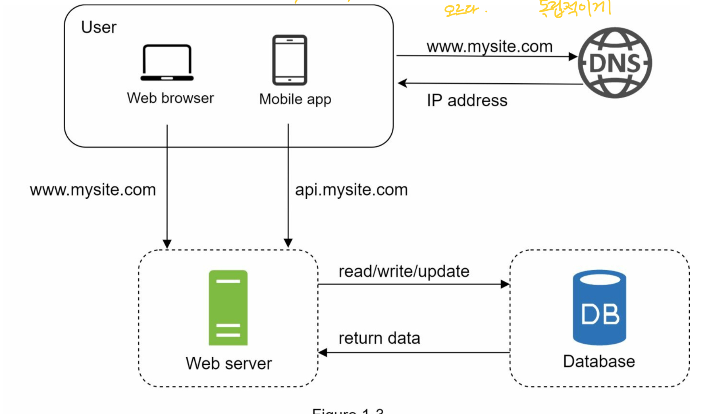
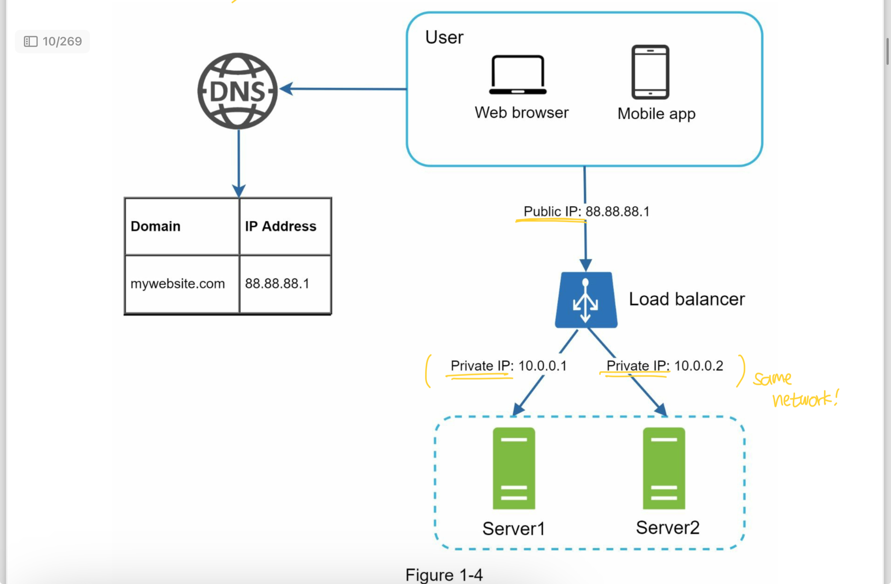
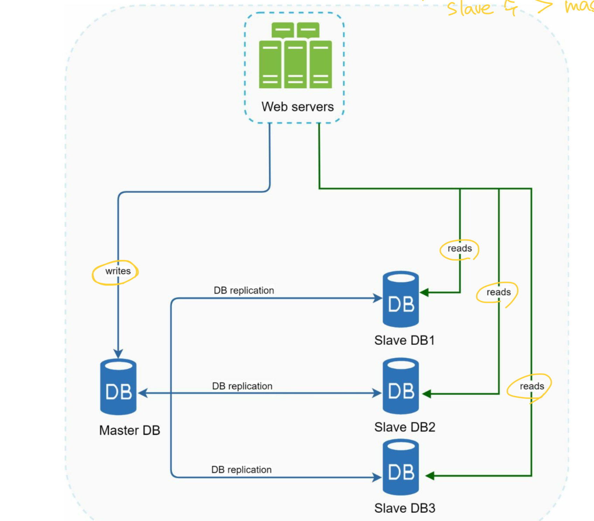

# 1. Single Server
### 절차

1. 유저가 도메인명으로 웹사이트에 접근한다. (예를 들면 api.mysite.com) DNS 에서 이를 IP 주소로 리턴하여 유저에게 전달한다.
2. IP 주소를 가지고 웹 서버에 HTTP 요청을 보낸다.
3. 웹 서버는 HTML page or Json 응답을 전달한다.

### Vertical Scaling vs Horizontal Scaling
- Vertical Scaling
  - 특징 : Scale UP 이라고 불리며, 서버의 파워를 증가시키는 작업이다.
  - 한계 : 단일 서버 당 올릴 수 있는 CPU나 메모리, RAM에 대한 제한이 있다. 이것으로도 서버 장애가 발생하는 경우 즉시 서비스를 사용할 수 없기 때문에 여전히 failover을 할 수 없다.

- Horizontal Scaling (이 방법이 더 desirable 하다.)
  - 특징 : Scale Out 이라고 불리며, 서버의 갯수를 증가시키는 작업이다.
  - 한계 : 갯수의 한계가 있을 수 있음.

### Single Server 의 한계
- 유저가 직접적으로 하나의 웹 서버에 연결되어 있기 때문에 웹 서버에 문제가 발생하는 경우 서비스 전체적으로 접근할 수 없는 장애가 발생할 수 있다.
- 만약 많은 유저가 동시 접근을 하게 되는 경우 웹 서버의 로드 리밋에 도달하게 되는 경우 마찬가지로 응답이 매우 지연되거나, 접근 할 수 없게 되는 문제가 발생할 수 있다.

### Conclusion
- 이러한 문제를 해결하기 위해 Load balancer를 사용할 수 있다.

# 2. Load balancer

- 로드 밸런서 풀에 연결된 웹 서버들에게 트래픽을 균등하게 분배하여 안정성 있는 서비스를 제공할 수 있다.

### 위 한계 점에 대한 해소
- 로드발란서 한 대를 추가하고, 웹 서버를 한 대 추가하는 경우 드디어 failover가 가능해진다.
  - 웹 서버 1에 문제가 생기는 경우 웹 서버 2로 라우팅 된다. 이 경우 두 대 중 한대라도 살아있다면 서비스에 문제가 없다는 것이다. 또한 우리는 정상적인 웹 서버를 로드발란서 풀에 새롭게 추가할 수도 있다.
  - 또한 이러한 방식은 가파르게 올라가는 트래픽에 대해 여러 웹 서버에 균등하게 분배하여 높은 트래픽 관련된 웹 서버 문제를 올바르게 핸들링 할 수 있다.

### Conclusion
- 로드 발란서를 사용하게 되면 웹 서버 이슈가 있는 경우 서비스가 들어갈 수 없는 등의 장애극복을 할 수 있다.

# 3. Database Replication

- master(original) / slave(copies) 로 구성이 되어있는 데이터 매니지먼트 시스템에서 가장 많이 사용하는 방식이다.
- master database는 오직 쓰기(입력, 수정, 삭제) 동작, slave database는 읽기 동작을 수행한다.
- master가 죽으면 slave 중 한 대가 master가 되며 새로운 slave를 추가된다. 다만 데이터 유실 건에 대해서는 내부적으로 스크립트나 최신화 할 수 있는 방안이 필요하다. (멀티 마스터, 원형복제 등)
- 오직 한 대 있는 slave가 죽을 경우 즉각 master에 읽기 동작을 함께 진행하고, 즉시 새로운 slave가 띄워지게 되며, 다시 읽기 동작을 slave에서 하게 된다.

### 위 한계 점에 대한 해소
- 더 나은 성능을 가지고 있다. master는 쓰기와 갱신/삭제를 진행하고, slave에서는 여러 대가 읽기를 진행하기 때문에 여러 쿼리들을 동시에 병렬적으로 수행할 수 있다.
- 높은 가용성과 신뢰성이 있다. 복제된 데이터들이 여러 지역에 걸쳐 서버에 저장되어있기 때문에만약 천재지변 등 어떠한 이슈로 데이터 서버가 문제가 발생하는 경우 다른 지역에 있는 다른 서버를 이용할 수 있다.

### Conclusion
- DB를 Single Server로 유지하지 말고 master/slave 구조로 data replication을 해야한다.

# Cache (Cache tier)

