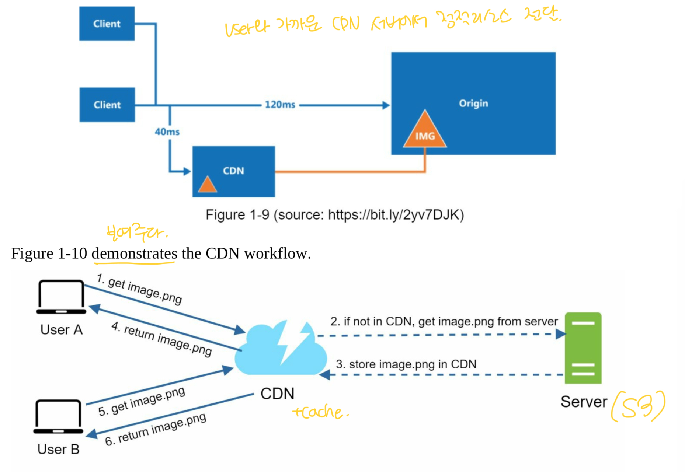

# 1. Single Server
### 절차

1. 유저가 도메인명으로 웹사이트에 접근한다. (예를 들면 api.mysite.com) DNS 에서 이를 IP 주소로 리턴하여 유저에게 전달한다.
2. IP 주소를 가지고 웹 서버에 HTTP 요청을 보낸다.
3. 웹 서버는 HTML page or Json 응답을 전달한다.

### Vertical Scaling vs Horizontal Scaling
- Vertical Scaling
  - 특징 : Scale UP 이라고 불리며, 서버의 파워를 증가시키는 작업이다.
  - 한계 : 단일 서버 당 올릴 수 있는 CPU나 메모리, RAM에 대한 제한이 있다. 이것으로도 서버 장애가 발생하는 경우 즉시 서비스를 사용할 수 없기 때문에 여전히 failover을 할 수 없다.

- Horizontal Scaling (이 방법이 더 desirable 하다.)
  - 특징 : Scale Out 이라고 불리며, 서버의 갯수를 증가시키는 작업이다.
  - 한계 : 갯수의 한계가 있을 수 있음.

### Single Server 의 한계
- 유저가 직접적으로 하나의 웹 서버에 연결되어 있기 때문에 웹 서버에 문제가 발생하는 경우 서비스 전체적으로 접근할 수 없는 장애가 발생할 수 있다.
- 만약 많은 유저가 동시 접근을 하게 되는 경우 웹 서버의 로드 리밋에 도달하게 되는 경우 마찬가지로 응답이 매우 지연되거나, 접근 할 수 없게 되는 문제가 발생할 수 있다.

### Conclusion
- 이러한 문제를 해결하기 위해 Load balancer를 사용할 수 있다.

# 2. Load balancer

- 로드 밸런서 풀에 연결된 웹 서버들에게 트래픽을 균등하게 분배하여 안정성 있는 서비스를 제공할 수 있다.

### 위 한계 점에 대한 해소
- 로드발란서 한 대를 추가하고, 웹 서버를 한 대 추가하는 경우 드디어 failover가 가능해진다.
  - 웹 서버 1에 문제가 생기는 경우 웹 서버 2로 라우팅 된다. 이 경우 두 대 중 한대라도 살아있다면 서비스에 문제가 없다는 것이다. 또한 우리는 정상적인 웹 서버를 로드발란서 풀에 새롭게 추가할 수도 있다.
  - 또한 이러한 방식은 가파르게 올라가는 트래픽에 대해 여러 웹 서버에 균등하게 분배하여 높은 트래픽 관련된 웹 서버 문제를 올바르게 핸들링 할 수 있다.

### Conclusion
- 로드 발란서를 사용하게 되면 웹 서버 이슈가 있는 경우 서비스가 들어갈 수 없는 등의 장애극복을 할 수 있다.

# 3. Database Replication

- master(original) / slave(copies) 로 구성이 되어있는 데이터 매니지먼트 시스템에서 가장 많이 사용하는 방식이다.
- master database는 오직 쓰기(입력, 수정, 삭제) 동작, slave database는 읽기 동작을 수행한다.
- master가 죽으면 slave 중 한 대가 master가 되며 새로운 slave를 추가된다. 다만 데이터 유실 건에 대해서는 내부적으로 스크립트나 최신화 할 수 있는 방안이 필요하다. (멀티 마스터, 원형복제 등)
- 오직 한 대 있는 slave가 죽을 경우 즉각 master에 읽기 동작을 함께 진행하고, 즉시 새로운 slave가 띄워지게 되며, 다시 읽기 동작을 slave에서 하게 된다.

### 위 한계 점에 대한 해소
- 더 나은 성능을 가지고 있다. master는 쓰기와 갱신/삭제를 진행하고, slave에서는 여러 대가 읽기를 진행하기 때문에 여러 쿼리들을 동시에 병렬적으로 수행할 수 있다.
- 높은 가용성과 신뢰성이 있다. 복제된 데이터들이 여러 지역에 걸쳐 서버에 저장되어있기 때문에만약 천재지변 등 어떠한 이슈로 데이터 서버가 문제가 발생하는 경우 다른 지역에 있는 다른 서버를 이용할 수 있다.

### Conclusion
- DB를 Single Server로 유지하지 말고 master/slave 구조로 data replication을 해야한다.

# 4. Cache
- 캐시는 비용이 많이 드는 응답 또는 메모리 상에서 빈번하게 접근하는 데이를 저장하는 임시 저장 공간 이며, 매번 데이터 획득을 위한 서버 요청을 하게 되면 부하가 증가할 수 있기 때문에 이러한 문제를 완화시키기 위한 솔루션이다.
- 캐시티어는 임시 데이터 저장 레이어이며, 이 레이어를 분리하면 성능적으로 이점을 얻을 수 있다. 데이터베이스의 부하를 줄일 수 있고 캐시 티어를 독립적으로 확장할 수 있다.
- 대부분 캐시서버는 다양한 api를 제공하기 때문에 이를 잘 활용할 수 있다.
- 언제 캐시를 사용할지, 캐시 만료 정책, 데이터 일관성, 실패 완화 정책(싱글 서버의 문제 - SPOF), 퇴거 정책(LRU, LFU, FIFO)을 고려하며 캐시를 설계해야 한다.

### 절차 (read-through cache strategy)

1. 유저가 웹서버에 요청을 한다.
2. 유저가 요청한 정보가 캐시에 있는지 확인한다.
   1.  없으면 DB로 부터 데이터를 조회하여 캐시에 저장하고, 그 결과 데이터를 응답한다.
   2.  있는 경우 캐시에서 데이터를 꺼내 응답한다.

### 위 한계 점에 대한 해소
- 데이터베이스 접근을 줄이고, 더 빠르게 응답이나 데이터를 리턴시킬 수 있다. 서버 접근 오버로드를 줄일 수 있다. 즉, 응답/로드시간 단축을 위한 개선을 할 수 있다.

### Conclusion
- 적절한 캐시 사용은 응답/로드시간 단축에 대한 개선을 할 수 있다. 따라서 반복적인 응답이나 데이터 조회는 캐시를 활용한다.

# 5. CDN(Content Delivey Network)

- CDN은 정적 콘텐츠를 전달하기 위해 지리적으로 흩어져있는 서버의 네트워크이다. 
- 이미지, 비디오, css, js 등 컨텐츠를 전달하고 캐싱한다.
- 요청한 유저 위치 기준으로 가까운 CDN 서버에서 리소스를 가져온다. 즉, 서버위치가 멀수록 응답/전달 속도가 늦어질 수 있다.
- 비용, 적절한 캐시 만료 정책, CDN 장애복구 정책 수립, 유효하지 않은 파일 처리(예를 들면 쿼리스트링을 이용한 버저닝, 혹은 API를 이용한 invalid 처리) 등 고려해야한다.

### 절차
1. 유저가 특정 이미지를 이미지 URL을 사용하여 요청하며, 이때 URL 도메인은 CDN 제공자가 제공한 도메인이다. (예를 들면 http://mysite.cloudfront.net/logo.jpg)
2. CDN 서버 내 캐시를 확인한다.
   1. 캐시에 없으면 CDN 에서 직접 origin에(웹 서버 또는 온라인 스토리지 서비스 - S3) 요청하여 리소스를 가져오는데 이 때 옵셔널로 http header와 ttl을 포함한다. 이러한 정보를 CDN 내 캐싱하며, TTL 만료시까지 이 이미지는 캐시서버에 유지된다.
   2. 캐시에 있으면 정보를 리턴한다.
3. 유저에게 이미지 리소스를 리턴한다.

### Conclusion
- CDN이 있으면 더 이상 웹 서버에 정적 리소스를 가지고 있지 않아도 된다.
- CDN 사용은 응답/로드시간 단축에 대한 개선을 할 수 있다. CDN으로 부터 데이터를 가져올 수 있으므로 더 나은 성능 이점을 얻을 수 있다.

# 6. Stateless web tier
## 1. statefull architecture

- 동일한 유저는 동일한 서버에 라우팅되어야 한다. 이러한 라우팅이 보장이 되려면 요청시 세션정보나 헤더정보 등 추가정보가 필요하다. 
- 서버를 추가하거나 삭제 시 장애 발생 위험이 높고, 구조적인 어려움을 겪을 가능성이 높다. 또한 서버 장애에 대한 대응도 어렵다.
- 예를 들면, 유저 A는 서버 1과 통신을 하였고, 그 서버에 세션정보를 저장하게 되기 때문에 앞으로도 계속 서버 1과 통신을 해야한다. 서버 1에 유저 A에 대한 정보가 있기 때문이다. 즉, 유저 A는 서버 2와 통신하게 되면 저장된 데이터가 없기 때문에 인증 오류나 기타 오류가 발생할 수 있다.

## 2. stateless architecture

- 유저로 부터 온 http 요청은 어떤 웹 서버로 가던 상관이 없다. 각 웹 서버는 공유된 데이터 저장소에서 데이터를 가져와 유저의 요청을 처리할 수 있다. 각 지역의 데이터는 공유 데이터에 저장이 되며, 이 중 하나의 웹 서버에 이슈가 생기더라도 서비스에 이상을 주진 않는다.
- 따라서 더 단순하고, 더 튼튼하고, 더 확장 가능한 방법이다.

# 7. Data centers
# 8. Message Queue
# 9. Logging, metrics, automatic
# 10. Database scaling

