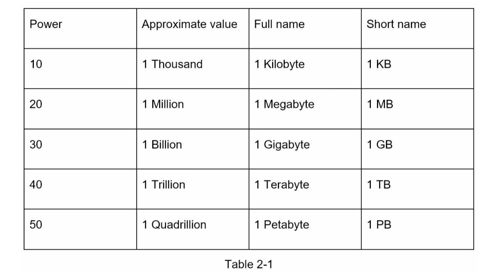

#### ✔ 해당 포스트는 [System Design Interview An Insider's Guide by Alex Xu](https://www.amazon.com/System-Design-Interview-insiders-Second/dp/B08CMF2CQF)의 서적을 번역하여 작성되었습니다.

# BACK-OF-THE-ENVELOPE ESTIMATION
- Back-of-the-envelope estimation 이란 봉투 뒷면 측정(계산) 이라는 의미로 대략적인 계산(추정)을 의미한다. 이것은 추측 보다는 정확도가 높지만 정확한 계산이나 수학적 증명보다는 정확도가 떨어진다. 즉, 오로지 단순화된 가정을 사용하여 측정하게 된다.
- 시스템 디자인 인터뷰에서 위 방법을 사용하여 때때로 시스템 용량 또는 성능 요구사항을 계산하는 것을 요청받을 수도 있다.

### Power of Two
- 분산 시스템을 다루면서 데이터의 양은 커져가지만 계산하는 방법은 모두 기초로 귀결된다. 정확한 계산을 하기 위해서는 데이터 볼륨 단위에 대해서 아는 것이 중요하다.
- 예시 : 1byte = 8bit, ASCII character = 1byte = 8bit

### Latency numbers every programmer should know
- 전형적인 컴퓨터 연산에 대한 길이(소요시간)가 정의되어있고 몇몇개의 숫자는 컴퓨터의 발전에 따라 최신화된 정보는 아니지만 이러한 정보를 기준삼아 각각 연산들의 빠름과 느림을 이해할 수 있다.
- 요약은 다음과 같다.
  - 메모리는 빠르고, 디스크는 느리다.
  - 디스크 탐색은 가능하면 피한다.
  - 단순 압축 알고리즘은 빠르다.
  - 가능하면 인터넷을 통해 데이터를 보내기 전에 압축을 먼저한다.
  - 데이터 센터는 보통 다른 지역에 있고, 그것들 사이에 데이터를 전송하는 것은 시간이 다소 소요된다.

### Availability numbers
- 높은 가용성이란 서비스가 오랫동안 지속적으로 작동할 수 있는 능력이며, 일반적으로 % 로 표현한다. 즉, 가용성이 100% 라는 것은 서버 다운타임이 0이라는 것을 의미한다. 대부분의 서비스가 99% ~ 100% 사이의 가용성을 유지한다.
- SLA (A Service Level Agreement) 라는 서비스 수준 협약서가 관련되어 있다.
  - 서비스를 제공함에 있어서 공급자와 사용자간에 서비스에 대한 측정지표와 목표 등에 대한 협약서 이며, 일반적으로 CPU 가용시간, 응답시간, 서비스 완료시간 등이 포함된다.
  - Provider는 Amazone, Google, MS 로 예시를 들 수 있고 그들의 SLA는 99.9% 이상이다.
- 일반적으로 가동시간은 9단위로 표현되며, 9의 갯수와 다운타임 숫자는 관련이 있다.

### Tips
- 결과를 얻는 것 보다는 문제를 해결하는 것이 더 중요하다.
- 면접관이 나의 문제해결을 테스트 할 것이다. 아래의 팁을 참고한다.
  - 1. 반올림하고 근사치로 계산한다. 예로 들어서 99987/9.1 을 100000/10 으로 근사치 계산하여 불필요한 시간낭비를 줄인다.
  - 2. 단위를 쓴다. 5가 아니라 5MB 인지 5GB 인지 단위까지 확실하게 쓴다.
  - back-of-the-envelope 측정에 대해 자주 묻는 질문을 준비한다. -> QPS, peak QPS, storage, cache, number of servers etc.

### Conclusion
- Practice makes perfect!