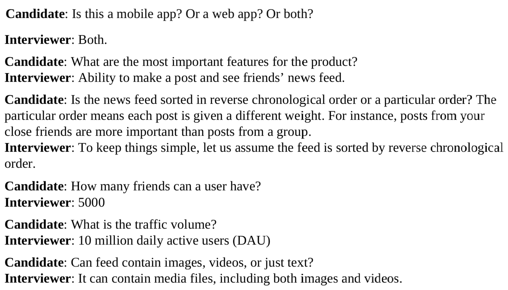

#### ✔ 해당 포스트는 [System Design Interview An Insider's Guide by Alex Xu](https://www.amazon.com/System-Design-Interview-insiders-Second/dp/B08CMF2CQF)의 서적을 번역하여 작성되었습니다.

# A Framework for system design interviews
- 시스템 디자인 인터뷰는 그들의 목표를 달성하기 위해 두명의 협력자가 협업하여 실제 세계의 모호한 문제를 해결하고 솔루션을 제시하는 것이다.
- 이를 통해 디자인 기술을 입증하고, 디자인 선택을 방어하며, 건설적인 방식으로 피드백에 대응할 수 있다.
- 가장 주된 목적은 면접관은 나의 능력을 정확하게 평가하기 위함이며, 또한 오버엔지니어링 (실제로 이를 무시하기 위한 비용이 드는 회사가 있음)이나 편협한 생각, 아집 등 마음가짐이나 태도를 포함한 좋지 않은 시그널도 함께 확인한다. 
- 대부분의 사람들은 개인의 기술적인 설계 능력이 전부라고 생각하지만 그 이상이다. 협업하는 능력, 중압감 속에서 일하는 것, 모호함을 건설적이게 해결하는 것 등을 살펴본다. 좋은 질문을 하는 것은 필수적인 역량이며 많은 면접관들은 이를 주의깊게 살펴본다.
- 아래는 단순하지만 효과적으로 시스템 디자인 인터뷰에 임할 수 있는 팁이다.

## 4-Step process for effective system design interview
- 각 회사별 시스템 디자인 인터뷰는 다르다. 좋은 시스템 인터뷰는 솔루션에 타이트한 제약을 두지 않는 것이다. 하지만, 대부분의 시스템 디자인 인터뷰를 아우르는 공통점이 있다. 4가지 단계로 설명한다.

### Step1. Understand the problem and establish design scope
- 답을 주기 위해 바로 문제에 바로 뛰어들지말고 천천히 차분하게 임한다. 깊게 생각하고 요구사항과 가정을 명확하게 하기 위해 질문한다. 그것이 가장 극도로 중요하다.
- 엔지니어로써 어려운 문제를 해결하는 것을 좋아하고 최종 설계에 뛰어든다. 하지만 이런식의 접근은 잘못된 시스템을 설계할 가능성이 매우 높다. 엔지니어로써 가장 중요한 기술은 아래와 같다.
  - 올바른 질문을 한다.
  - 적절한 가정을 만든다.
  - 시스템을 구축하기 위해 필요한 모든 정보를 모은다.
- 어떠한 짐룬을 해야할까? 면접관은 대부분 당신의 질문에 직접 답을 하거나 너의 가정을 확인하기 위해 질문을 한다. 아래의 질문 목록은 예시이며, 대략 이런식으로 시작해보면 좋다.
  - 어떤 구체적인 기능이 필요한지?
  - 해당 제품의 사용자 수는 몇명인지?
  - 회사는 얼마나 빠른 규모로 확장할 것인지? 3개월,6개월,1년 후 예상 규모는 어떻게 되는지?
  - 회사의 기술 스택은 무엇인지? 설계를 단순화 하기 위해 활용할 수 있는 기존 서비스는 무엇인지?
- 아래는 인터뷰 예시이다. 

#### Conclusion
- 가장 중요한 것은 요구사항을 이해하고 모호한 것을 명확하게 하는 것이다. 이를 해결하기 위해 좋은 질문을 활용해야 한다.

### Step2. Propose high-level desing and get buy-in
- 이 단계에서는 높은 수준의 설계의 개발하고, 면접관과 설계에 대한 합의를 이루는 것을 목표로 한다. 이러한 과정 속에서 면접관과 협력하는 것은 좋은 생각이다.
  - 청사진을 제시하라. 피드백을 요청하라. 너의 면접관을 팀원처럼 대하고 함께 일하는 것처럼 하라. 대부분의 면접관들은 이야기하는 것과 참여하는 것을 좋아한다.
  - 종이나 칠판에 주요한 컴포넌트를 담은 다이어그램을 그려라. 클라이언트(모바일, 웹), API, 웹서버, 데이터 스토어, 캐시, CDN, 메시지 큐 등이 포함되어 있을 것이다.
  - 너의 청사진이 스케일 요구사항에 맞는지 평가하기 위해 Back-of-the-envelope estimation을 활용하라. 크게 생각해보라. 이러한 측정법에에 내용을 추가하기 전에 필요한 경우 면접관과 대화한다.
- 가능하면 몇가지의 구체적인 유즈 케이스를 고려한다. 그것은 설계하는데에 도움이 된다. 이러한 유즈케이스를 통해 고려하지 못했던 엣지 케이스를 발견하는데에 도움을 받을 수 있다.
- 무조건 면접관과 소통하면서 어떤 것들이 포함되어야하고 필요한지 파악해나가야 한다.

#### Conclusion
- 모호하면 면접관과 소통하여 명확하게 요구사항을 파악하고 이해해야 한다. 몇 가지 유즈케이스를 활용하여 엣지케이스를 찾아내는 것도 좋다.

### Step3. Design deep dive
- 이 단계에서는 면접에서 아래와 같은 항목들을 달성했다.
  - 동의된 종합적인 목표와 기능의 범위
  - 종합적인 설계에 대한 개략적인 설계 청사진
  - 높은 수준 설계에 대한 면접관으로부터의 피드백
  - 피드백을 바탕으로 심층 분석에서 집중해야 할 영역에 대한 몇 가지 초기 아이디어
- 때때로 시니어 후보자 인터뷰의 경우, 시스템 성능 특징(병목현상, 리소스 추정 등)에 대한 논의가 이루어질 수 있다.
- 대부분의 상황에서 면접관들은 어떤 시스템 컴포넌트의 상세로 깊이 파고드는 것을 원할 수 있다. 예를 들어 URL 쇼트너에서 긴 URL을 짧게 만드는 해시 함수, 채팅 시스템에서 레이턴시 감소와 온오프라인 상태에서 어떻게 제공할지 등 이러한 예시들은 흥미로운 주제이다.
- 세부항목들에 너무 신경을 쓰다보면 휩쓸리기 쉽기 때문에 따라서 시간 관리는 필수적이다.

#### Conclusion
- 필요하지 않은 세부항목에 대해 너무 깊이 들어가지 마라. 시간은 한정되어 있기 때문에 너무 불필요하게 세부항목들에 신경 쓰다보면 시간을 낭비할 수 있다. 시간 관리는 필수적이다.

### Step4. Wrap up
- 마지막 단계이며, 면접관은 후속 질문 또는 다른 추가적인 포인트에 대한 질문들을 할 수 있다.
  - 면접관은 시스템 보틀넥에 대한 식별과 잠재적인 개선에 대한 부분에 대한 언급을 원할 수 있다. 나의 설계가 완벽하고 개선점이 없다고 말하면 안된다. 개선점에 대한 고민을 해본다. 그것이 마지막 임팩트를 남길 수 있는 좋은 기회이다.
  - 면접관에게 너의 설계의 요약을 알려주는 것이 도움이 된다. 특히 너가 몇가지 해결책을 제시한 경우 더 중요하다. 오랜 세션 후에 면접관의 기억을 되살려 주는 것이 도움이 될 수 있다.
  - 에러 케이스(서버 실패, 네트워크 유실 등)는 흥미로운 대화 주제이다.
  - 운영 이슈도 언급할 가치가 있다. 어떻게 메트릭과 에어로그를 모니터링 할 것 인지? 어떻게 배포할 것인지?
  - 다음 규모 곡선을 어떻게 다룰 것인지? 예를 들어 현재 설계가 1m 유저라고 한다면, 무엇을 바꿔야 10m의 유저가 수용가능할지를 고려해본다.
  - 시간이 남는다면 다른 개선도 제안한다.

#### 해야할 것과 하지 말아야 할 것
  - 해야할 것
    - 항상 명확함을 위해 질문하라. 너의 가정(생각)이 맞다고 짐작(확신)하면 안된다.
    - 문제의 요구사항을 이해하라.
    - 정답과 최고의 답은 없다. 젊은 스타트업의 문제를 해결하기 위한 솔루션은 수백만명의 사용자를 보유한 회사의 솔루션과는 다르다. 요구사항을 정확하게 이해하라.
    - 면접관에게 너의 생각을 알게하라. 소통과 함께하는 인터뷰가 되어야 한다.
    - 가능하면 여러개의 다양한 접근을 제안한다.
    - 청사진에 대해 면접관의 의견에 동의하면 각 구성 요소에 대한 세부 정보를 자세히 살펴보라. 가장 중요한 구성 요소를 먼저 설계해야 한다.
    - 아이디어에 대한 면접관의 반응을 살펴라. 좋은 면접관은 팀원처럼 협력한다.
    - 포기하지 마라.
  - 하지 말아야 할 것
    - 일반적인 인터뷰 문제를 준비하지 마라. (어렵고, 다양한 것들 준비해야한다.)
    - 요구사항과 가정에 대한 명확함 해결책을 만드는데 뛰어들지 마라.
    - 하나의 컴토넌트에 너무 디테일하게 파고들지 마라. 전체적인 설계 후에 하나씩 파고들어라. (중요한 순서대로)
    - 난관에 봉착한 경우 힌트를 얻기위해 질문하는 것을 망설이지 마라.
    - 다시 반복하는데 소통하라. 침묵속에서 생각하면 안된다.
    - 설계가 나름대로 끝났다고 해서 끝났다고 생각하지 마라. 면접관이 끝났다고 이야기하기 전까지 끝난 것이 아니다. 피드백을 자주 빨리 요청해라.

#### 각 단계별 시간할당하기
  - 짧은 시간동안 진행하는 만큼 시간관리는 매우 중요하다. 아래는 각 단계별 러프하게 시간을 산정한 가이드이며, 꼭 기억하도록 한다. 인터뷰 시간을 45분에서 60분으로 고려하였고, 실제 시간은 문제의 범위나 면접관의 요구사항에 따라 다소 달라질 수 있다.
  - 1단계. 문제를 이해하고 설계 범위를 세운다 : 3-10분
  - 2단계. 높은 수준의 설계를 제안하고 승인을 받는다 : 10-15분
  - 3단계. 심층적으로 설계한다 : 10-25분
  - 4단계. 마무리한다 : 3-5분

#### Conclusion
- 다시 한 번 말하지만, 지레짐작하지 말고 면접관과 소통하면서 진행한다.
