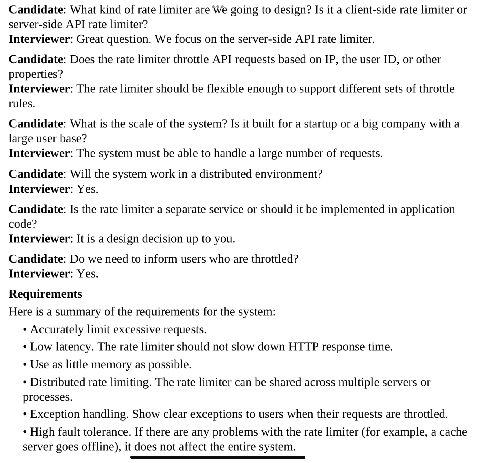
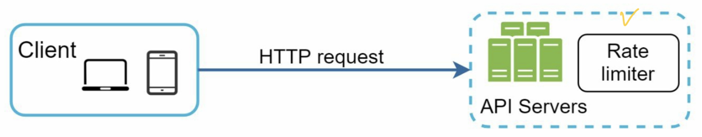
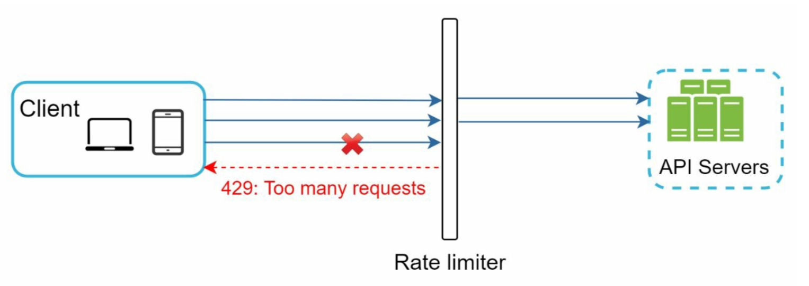
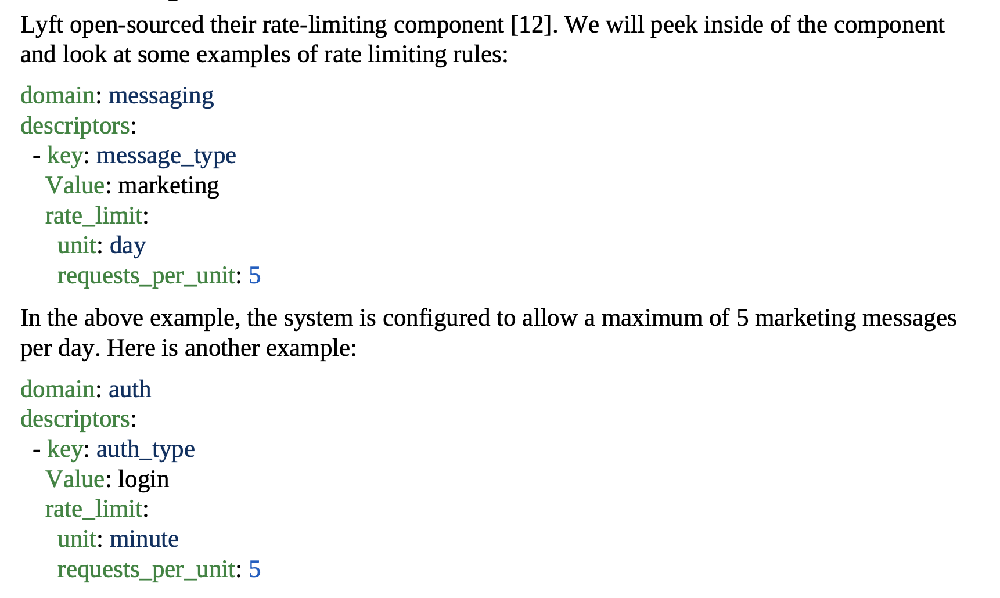
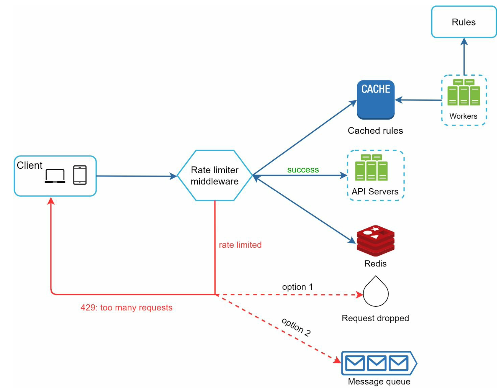
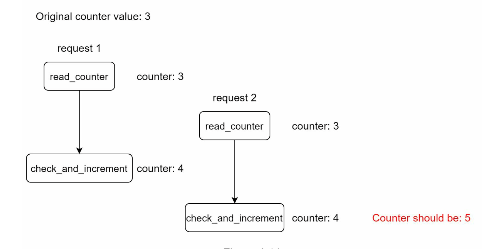
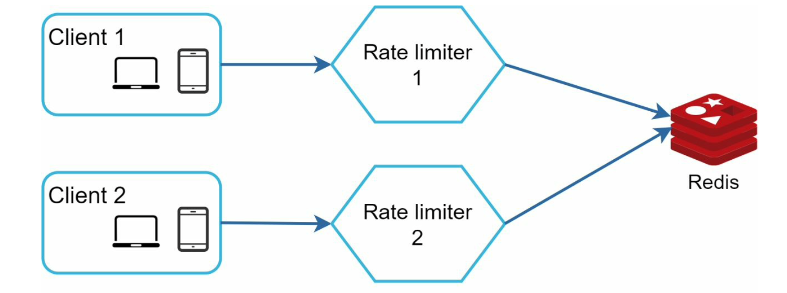

#### ✔ 해당 포스트는 [System Design Interview An Insider's Guide by Alex Xu](https://www.amazon.com/System-Design-Interview-insiders-Second/dp/B08CMF2CQF)의 서적을 번역하여 작성되었습니다.

# Design A Rate Limiter
- 네트워크 시스템에서 rate limiter는 클라이언트 또는 서비스에 의해 보내지는 트래픽의 비율을 컨트롤하기 위해 사용된다.
- 한계점으로 정의되어있는 수치를 초과하여 요청된 경우, 추가 요청된 콜은 blocked 된다.

### The benefits of using an API rate limiter
- 리소스 낭비를 야기하는 Dos 공격을 막는다.
  - 한계점을 넘어선 호출이 발생하는 경우 추가 요청된 콜을 blocked 함으로써 Dos 공격을 방어할 수 있다. 큰 테크기업(트위터, 구글 등)은 일정한 형식의 rate limit 룰을 가지고 있다.
- 비용을 감소한다.
  - 추가 요청된 콜을 제한하는 것은 더 적은 서버로 더 우선순위 높은 작업에 리소스를 할당할 수 있다는 것을 의미한다. 특히 써드파티 API를 사용하는 회사들은 rate limit이 매우 중요하다. 보통 콜 단위로 요금이 부과되기 때문이다. 따라서 콜 수를 제한하는 것은 비용을 줄이는데 있어서 필요하다.
- 서버가 과부하/과적으로 부터 막는다.
  - 서버의 부하를 감소하기 위해 rate limiter는 봇이나 유저의 잘못된 방식으로 요청된 추가적인 콜을 걸러낸다.

### Step1. Understand the problem and establish design scope
- rate limit은 여러 알고리즘으로 구현될 수 있으며, 각 알고리즘은 장단점을 가지고 있다. 면접관과의 소통은 어떠한 타입의 rate limiter를 만들지 명확하게 하는데 도움이 된다.
- 
- 대략 요구사항을 요약하면 아래와 같다.
  - 과도한 요청은 정확하게 제한한다.
  - 낮은 레이턴시를 유지한다. HTTP 응답이 느려지면 안된다.
  - 가능하면 메모리를 적게 사용한다.
  - 분산 환경에서의 rate limit을 고려한다.
  - 명확한 오류 핸들링이 필요하다.
  - 실패에 대한 높은 저항성이 필요하다.

#### Conclusion
- 정확한 요구사항과 스펙을 알기 위해 면접관과 소통하면서 명확하게 만들어간다.

### Step2. Propose high-level desing and get buy-in
#### Where to put the rate limiter?
- 클라이언트 사이드 보다는 서버 사이드가 적합하다.
  - 클라이언트 코드를 컨트롤 할수 없고, 대체적으로 악의적인 유저에 의해 쉽게 위조될 수 있으므로 신뢰성이 다소 떨어진다.

- 하지만 서버사이드 보다는 따로 미들웨어로 두는 것이 적합하다.
  - 1초당 2개의 요청이 허용되는 경우, 3개의 요청이 들어왔을 때 1개의 요청은 제한되며 HTTP 429 code(too many request)로 반환되어 사용자에게 노출될 것이다.
  - 일반적으로 클라우드 마이크로 서비스가 널리 보급이 되고 있고 rate limiting은 일반적으로 API Gateway 내에 포함되어 있다. API Gateway는 SSL termination, auth, IP Whitelisting, servicing static content 등 전체적으로 관리해주는 솔루션이다.
  - rate limiter를 설계할 때, 어디에 rate limiter를 구현할 것인지? 서버사이드 인지 또는 게이트웨이인지? 에 대한 질문을 떠올려야 한다.
    - 그 회사의 기술스택에 따라 달라져있고, 기술적 리소스, 우선순위, 목표에 따라 다르게 선택할 수 있다.
      - 기술 스택을 확인하라. 예를들어 프로그래밍 언어가 그 알고리즘을 구현하는데 있어서 좀 더 효율적이라면 직접 서버사이드에 구현하면 되는 것이다.
      - rate limiting 알고리즘이 회사의 비즈니스 니즈에 부합하는지 확인하라. 만약 알고리즘 구현을 선택하게 되면 전체적인 관리를 직접 해야한다.
      - 이미 MSA를 사용하거나 기존 설계 내 API Gateway가 있다면 그것을 그대로 활용해도 좋다. 
      - rate limiting 서비스를 구현하는 것에 시간이 소요된다. 따라서 충분한 기술 리소스가 있는지 확인하라. 그게 아니라면 API Gateway가 더 나은 옵션이다.

#### Algorithms for rate limiting
- 자세한 내용은 책을 확인하길 바란다. 종류는 아래와 같다.
1. Token bucket
2. Leaking bucket
3. Fixed window counter
4. Sliding window log
5. Sliding window counter

### Step3. Design deep dive
- 아래의 질문에 답을 찾아야한다.
  - rate limiting 규칙을 어떻게 만들까? 그리고 어디에 저장할까?
  - rate limiting에 걸린 요청들은 어떻게 처리할까?

#### 1. Rate limiting rules
- Lyft는 rate limiting 컴포넌트를 오픈소스로 제공하였고, 이를 통해 컴포넌트의 내부와 몇가지의 rate limiting 규칙을 볼 수 있다.

- 일반적으로 규칙은 config 파일로 작성되며, 디스크에 저장된다.

#### 2. Exceeding the rate limit
- 요청이 rate limited 되는 케이스에서 API는 HTTP 응답 코드로 429(too many requests)를 클라이언트에게 던진다. 유즈 케이스에 따라 rate limited된 요청을 큐에 집어넣어서 나중에 처리하도록 할 수 있다.

##### 2-1. Rate limiter headers
- 어떻게 클라이언트는 자기 자신이 막혔다는 것을 알 수 있을까? 그리고 클라이언트는 막히기 전 몇개의 요청이 허용될 수 있는지 알 수 있을까? 그 답은 HTTP 응답 헤더에서 알 수 있다. rate limiter은 아래와 같은 HTTP 헤더를 클라이언트에게 리턴해준다.
  - *X-Ratelimit-Remaining* : 윈도우 내 허용된 남은 요청의 수
  - *X-Ratelimit-Limit* : 클라이언트가 윈도우, 시간 당 얼마나 많은 호출을 할 수 있는지 나타낸다.
  - *X-Ratelimit-Retry-After* : 제한 없이 다시 요청할 수 있을 때 까지 기다리는 시간
- 만약 유저가 429, too many request를 받았다면 그 응답과 *X-Ratelimit-Retry-After* 헤더를 같이 받게 된다.

#### 3. Detailed design

- 규칙은 디스크에 저장이 되며, workers는 디스크 그리고 저장된 캐시에서 빈번하게 룰을 땡겨온다.
- 클라이언트가 요청을 보내면, 그 요청은 rate limiter 미들웨어에 먼저 도달한다.
- rate limiter 미들웨어는 캐시로 부터 규칙(카운터와 마지막 요청 타임스탬프)을 가져온다. 응답에 기반하여 rate limiter은 아래의 사항을 고려한다.
  - 만약 요청이 rate limited가 되지 않았으면 API Server로 포워드 한다.
  - 만약 요청이 rate limited가 되었다면, 429 응답과 오류를 클라이언트에게 전달하고, 그 동안 요청은 dropped가 되던지 인큐가 되던지 설계 내용에 따라 달라질 수 있다.

#### 4. Rate limiter in a distributed environment
- 단일 서버에서 rate limiter를 구축하는 것은 어렵지 않으나, 멀티 서버 그리고 동시 스레드를 지원하도록 시스템을 확장시키는 것은 다른 이야기이다. 아래의 두가지 도전(이슈)가 있다.
  - Race Condition
  - Synchronization issue
  
##### 4-1. Race Condition
- Race Condition은 동시성 환경에서 발생할 수 있다.

- 레디스 내 있는 카운터 값이 3이라고 가정하면, 요청 1과 2는 거의 동시에 값을 읽고 그중 조금 더 빨리 요청했던 요청 1이 먼저 카운트를 +1 하게 되는 경우 레디스에 4가 반영이 되지만, 요청 2가 가지고 있는 값은 3이기 때문에 거기에서 다시 +1을 하게되면 결국 요청1과 2를 처리하는데 카운터가 1개만 증가하는 이슈가 있다. 실제로 정확한 값은 5이어야만 한다.
- Lock은 race condition을 해결하기 위해 사용하는 것은 명백한 솔루션이다. 그러나 Lock은 시스템 속도를 저하시킨다. 
- 일반적으로 이를 해결하기 위한 2가지 방법이 있다.
  - Lua Script
  - Sorted Set by Redis

##### 4-2. Synchronization issue
- 동기화 이슈는 분산 환경에서 중요하게 고려해야 할 또다른 요소이다. 수백만명의 유저를 지탱하기 위해서는 하나의 rate limiter로 트래픽을 다루기에는 부족하다. 다수의 rate limiter를 사용하게된다면 동기화는 필요하다.
- stateless 한 설계를 위해서는 레디스처럼 중앙 집권화된 데이터 스토어가 필요하다.

##### 4-3. Performance optimization
- rate limiter를 위해서 다중 데이터 센터 설치는 중요하다. 데이터 센터로 부터 멀리 떨어진 유저는 레이턴시가 높기 때문이다. 대부분의 클라우드 서비스 업자들은 전세계에 많은 지역에 엣지 서버를 만들었다. 레이턴시를 줄이기 위해 트래픽은 자동적으로 가장 가까운 엣지 서버에 라우팅된다.
- 최종일관성모델을 사용하여 데이터를 동기화한다. (챕터 6 참조)

##### 4-4. Monitoring
- rate limiter를 넣은 이후에 rate limiter가 효율적인지를 판단하기 위한 분석 데이터를 얻는 것이 중요하다.
  - rate limiting 알고리즘으 효율적인지
  - rate limiting 규칙이 효율적인지
- 예를 들어 규칙이 너무 엄격하면 유효한 요청들이 dropped 될텐데, 이 경우에는 규칙을 조금 더 완화 시키면 될 것이다. 다른 예시로는 flash sale처럼 갑자기 트래픽이 증가할 때 우리가 정의한 rate limiter가 비효율적인 것을 알게 될 수도 있다. 그러한 경우 급격히 증가하는 트래픽에 대응이 가능한 알고리즘으로 변경하면 된다. 이를 테면 Token bucket 알고리즘으 적절하다.

### Step4. Wrap up
- rate limiter를 구현할 수 있는 다양한 알고리즘이 있고, 각각의 장단점을 이해하여 활용해야 한다.
  - Token bucket
  - Leaking bucket
  - Fixed window counter
  - Sliding window log
  - Sliding window counter
- Hard vs Soft rate limiting 방식이 있다.
  - Hard: 요청 수는 임계값을 초과할 수 없다.
  - Soft: 요청이 단기간 동안 임계값을 초과할 수 없다.
- 해당 챕터에서는 OSI 7계층에서 7번 레이어인 HTTP에 국한하여 이야기하였지만, 다른 레이어로도 가능하다. 
- rate limited가 되는 것을 피하기 위해서는 클라이언트와 설계시 고려하면 좋을 best practice가 있다.
  - 빈번한 API 호출을 피하기 위해 클라이언트 캐시를 사용한다.
  - 제한에 대해 이해하고 짧은 시간 동안에 요청을 보내지 않도록 한다. 
  - 예외처리 또는 오류를 캐치하는 코드를 포함하여 클라이언트가 이러한 오류처리를 잘 활용하여 처리할 수 있도록 한다.
  - 충분한 백오프 재시도 요청을 추가한다.
