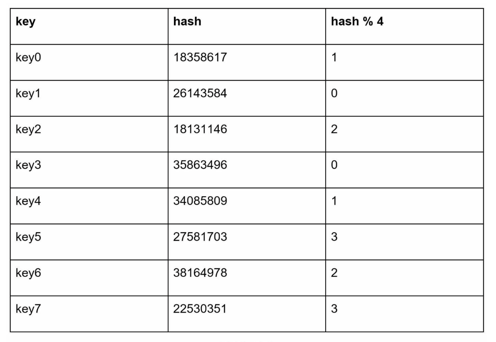
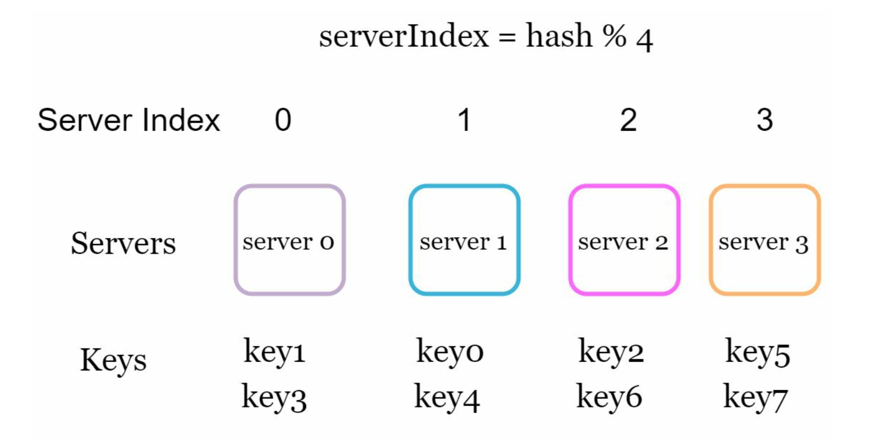
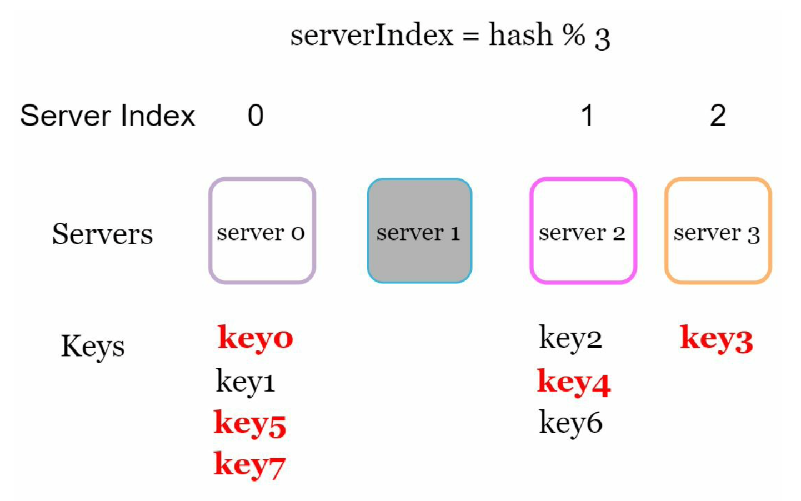
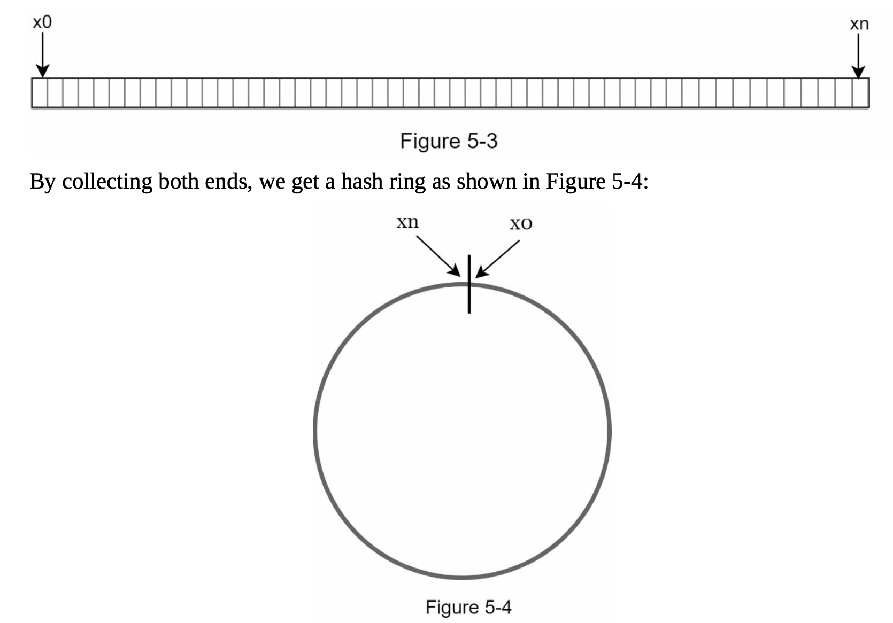
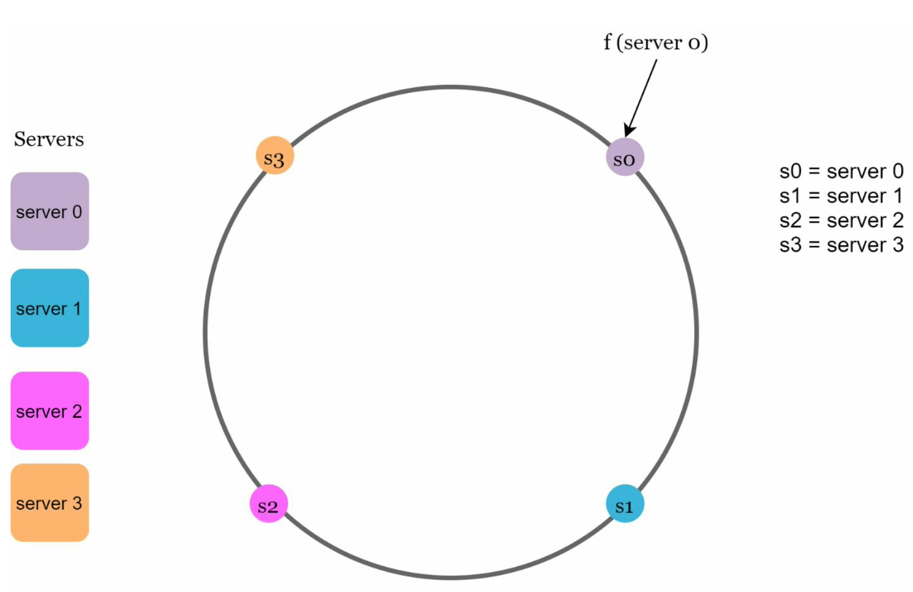
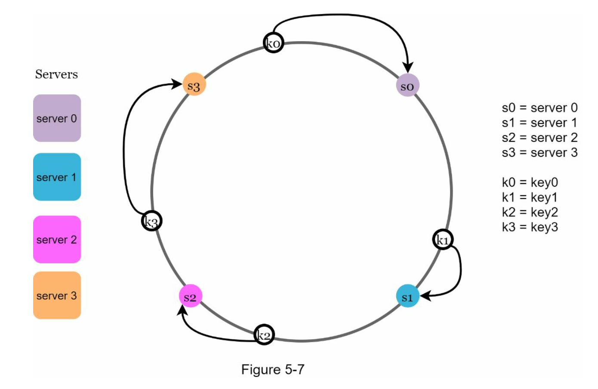
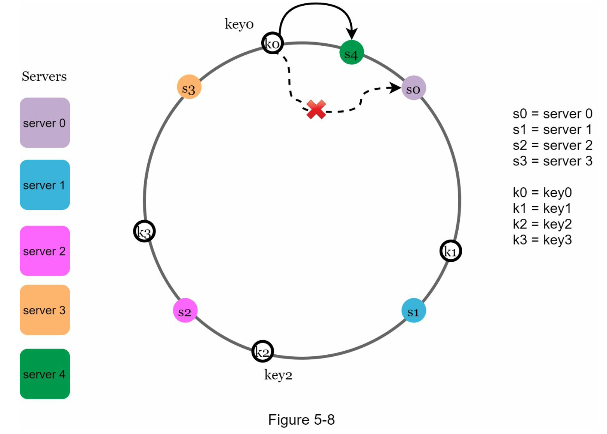
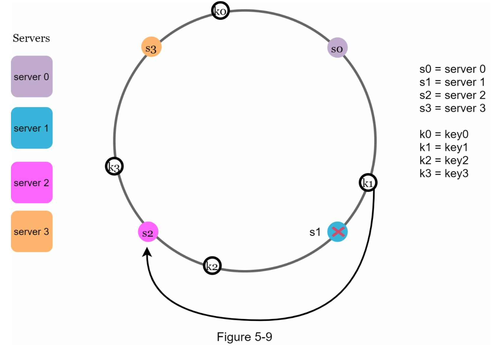
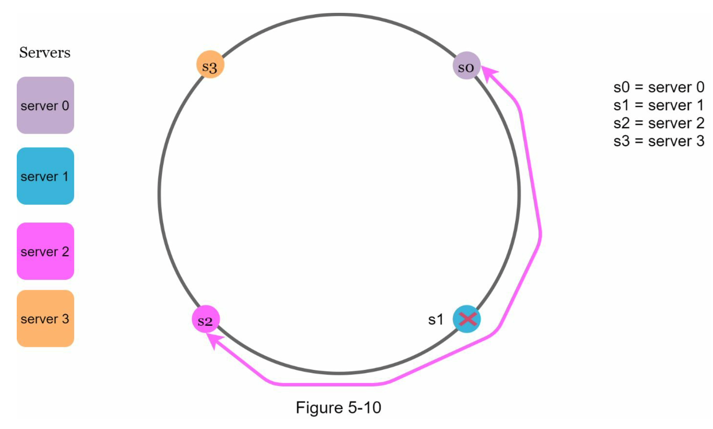
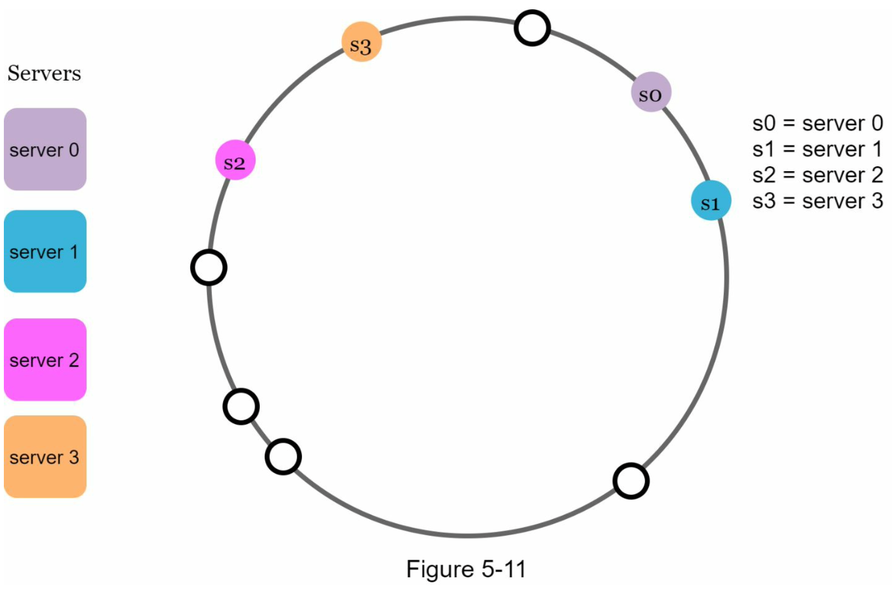

#### ✔ 해당 포스트는 [System Design Interview An Insider's Guide by Alex Xu](https://www.amazon.com/System-Design-Interview-insiders-Second/dp/B08CMF2CQF)의 서적을 번역하여 작성되었습니다.

# Design Consistent Hashing
- 수평적 스케일링을 달성하기 위해서 여러 서버에 걸쳐서 요청/데이터를 효율적으로 균등하게 분배하는 것은 중요하다.
- Consistent Hashing은 이러한 목표를 달성하기 위해 일반적으로 사용하는 기술이다.

### The rehashing problem
- 만약 n개의 캐시 서버가 있다면 로드의 균형을 맞추기 위해 흔히 사용하는 방식은 아래에 있는 해시 함수이다.
  - *serverIndex = hash(key) % N*, N은 서버 풀의 사이즈이다.
  - 
  - 키가 저장되어있는 서버를 가져오기 위해서는 모듈화된 함수 (key) % 4 를 사용해서 가져올 수 았다. 
  - 
- 이러한 접근은 서버 풀 사이즈가 고정이 되어있는 경우와 데이터 분배가 고른 경우에만 잘 동작할 것이다. 그러나 새로운 서버가 추가되거나 기존의 서버가 삭제되는 경우 문제가 발생한다.
  - 예를 들어, 서버 하나가 오프라인이 되는 경우 서버의 갯수는 3개가 되며, 모듈식 연산을 적용하면 서버 수가 1개 줄어들기 때문에 서버 인덱스가 달라진다. 그래서 hash % 3을 결과로 얻을 수 있다.
  - 
  - 이렇게 되는 경우 오프라인된 서버1에 저장된 키 뿐만 아니라 대부분의 키가 재분배가 된다. 결국 서버 1대가 오프라인이 되면 대부분 캐시 클라이언트는 데이터를 가져오기 위해 잘못된 서버에 연결하게 될 것이다. 이에 따라 폭풍같은 캐시미스를 야기하게 될 것이다. 이 문제를 완화시키기 위해 Consistent hashing은 효과적인 기술이다.

### Consistent hashing
- 위키 피디아에 따르면 일관된 해싱은 해시 테이블의 크기가 조정되고 일관된 해싱이 사용될 때 평균적으로 k/n개의 키만 다시 매핑해야 하는 특별한 종류의 해싱이다. k는 키의 수, n은 슬롯의 수 입니다. 이와는 대조적으로 전통적인 해시 테이블에서는 해시 테이블 크기가 조정되는 경우 모든 키가 다시 매핑이 필요하다.
  #### Hash Space and hash ring
  
  #### Hash Keys
  - cache 키들이 해싱링 위에 해싱되어있다.
  - 
  #### Server lookup
  - 키가 어떤 서버에 저장되어있는지 알아내기 위해서는 서버를 찾을 때 까지 링의 위치에서 시계방향으로 순회한다. 
  - 
  #### Add a server
  - 위에서 정의한 로직을 사용하자면 서버를 추가할 때 키들 중 일부만 재분배가 필요하다.
  - s4가 추가되면, 오직 k0만 재분배가 필요하다. k1, k2, k3은 같은 서버에 남아있다. s4가 추가되기 전에 k0는 s0에 저장되어있었다. 하지만 지금 k0는 s4에 저장이 될 것이다. s4는 k0 위치 기준으로 시계방향 순회하는 과정에서 마주하는 첫번째 서버이기 떄문이다. 따라서 일관적인 해시에 따르면 다른 k들은 재분배가 될 필요가 없다.
  - 
  #### Remove a server
  - 일관적인 해시에 따르면 서버가 제거되면 키의 매우 작은 부분들만 재분배 된다. s1이 제거되면, 오직 k1만 s2애 재맵핑이된다. 나머지 k들은 영향 받지 않는다.
  - 
  #### Two issues in the basic approach
  - 링 위에서 서버와 키를 매핑하는 것은 균일하게 분배하는 해시 함수를 사용한다.
  - 키가 어떤 서버에 매핑이 되었는지 찾기 위해 링 위에서 키 위치부터 첫번째 서버를 찾을 때까지 시계방향으로 순회한다.
  - 위 두가지 접근으로 문제점이 발생한다.
    - 서버를 추가하거나 삭제하는 것을 고려하면 모든 서버에 대해 링 위에서 동일한 사이즈의 파티션을 유지하는 것이 불가능하다. 파티션은 인접한 서버들 간의 해시 공간이다. 가능하다. 링 위에 각 서버에 할당된 파티션의 크기는 매우 작거나 상당히 클 수도 있다.
      - 예를 들면. s1이 제거되었을 때, s2의 파티션은 s0와 s3보다 두배이다.
      - 
    - 링 위에 비균일한 키 분배가 될 수 있다. 
      - 예를 들면, 아래와 같이 위치되어있다면, 대부분에 키는 s2에 저장이 될 것이고, s1와 s3에 저장된 데이터는 없다.
      - 
  #### Virtual nodes (작성중)
  - 가상 노드는 실제 노드를 참고하며, 각 서버는 여러개의 가상 노드들로 링 위에 표현되어 있다. 
  - 예로 들면 s0과 s1은 3개의 가상 노드를 가지고 있다. s0을 사용하는 대신에 s0_0, s0_1, s0_2이며, s1 대신에 s1_0, s1_1, s1_2으로 사용한다.

### wrap up
- 일관적인 해싱에 이점은 아래와 같다.
  - 서버기 추가되거나 삭제될 때 최소한의 키만 재분배 된다.
  - 데이터가 더 균등하게 분배되어있기 때문에 수평적으로 확장시키기 쉽다.
  - 핫스팟 키 문제를 완화하고, 특정한 샤드로의 지나친 접근은 서버 과부하가 발생할 수 있다. (Kate Perry, Justin Bieber, Lady Gaga가 한 샤드에 속해있다고 가정하라.) 일관적인 해싱은 데이터를 더 균등하게 분배함으로써 이러한 문제를 완화시킨다.
- 일관적인 해싱은 몇가지 주목할만한 시스템을 포함하여 실제 시스템에서 넓게 사용된다. 
  - Amazon Dynamo DB의 컴포넌트 분할, Apache Cassandra에서 여러 클러스터에 걸친 데이터 분할, Discord 채팅, Akamai 콘텐츠 딜리버리 네트워크, Maglev 네트워크 로드 발란서 등..